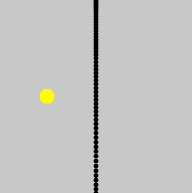

접속 주소 : <http://moonsunmo.github.io/PoeticCodeForNature/>

## 이혜원
 * 서울예술대학교 디지털아트전공 16학번
 * 인생 종강 인생 퇴근
 * 게임 애니메이션 포트폴리오를 준비하고 있습니다.
 * 시간이 갈수록 애니메이션 잡는 것 밖에 모르는 바보가 되어가고 있습니다...

## 작업
 * [HairLoss](./HairLoss/)
  - 자라나라 머리머리

    

  - 아래방향 화살표를 눌러서 발모제를 발라줄 때마다 머리카락이 자라난다.
    탈모인의 머리카락이 자라날수록 얼굴색은 우울함을 상징하는 파란색에서 행복함을 상징하는 노란색으로 변한다.

 * [TongTong](./TongTong/)
  - 통통 튀는 국수 음식들

       

  - 배고픔에 국수 음식이 아른아른 나타난다. 눈앞에서 통통 튀는 국수 음식들. 큰 국수 음식을 보면 배고픔이 커지고, 국수 음식을 먹고 싶은 그 마음이 국수 음식을 무겁게 만든다.

 * [Color Bubble](https://editor.p5js.org/vvee2929@gmail.com/sketches/60lGoNa8G)

    

 * [Party People](https://editor.p5js.org/vvee2929@gmail.com/sketches/G9nlXeyWu)

    

 * [Blow Painting](https://editor.p5js.org/vvee2929@gmail.com/sketches/9j42u0FN3)

    

 * [ChainShape_Simple](./ChainShape_Simple/)
  - Box2D 예제 ChainShape_Simple
